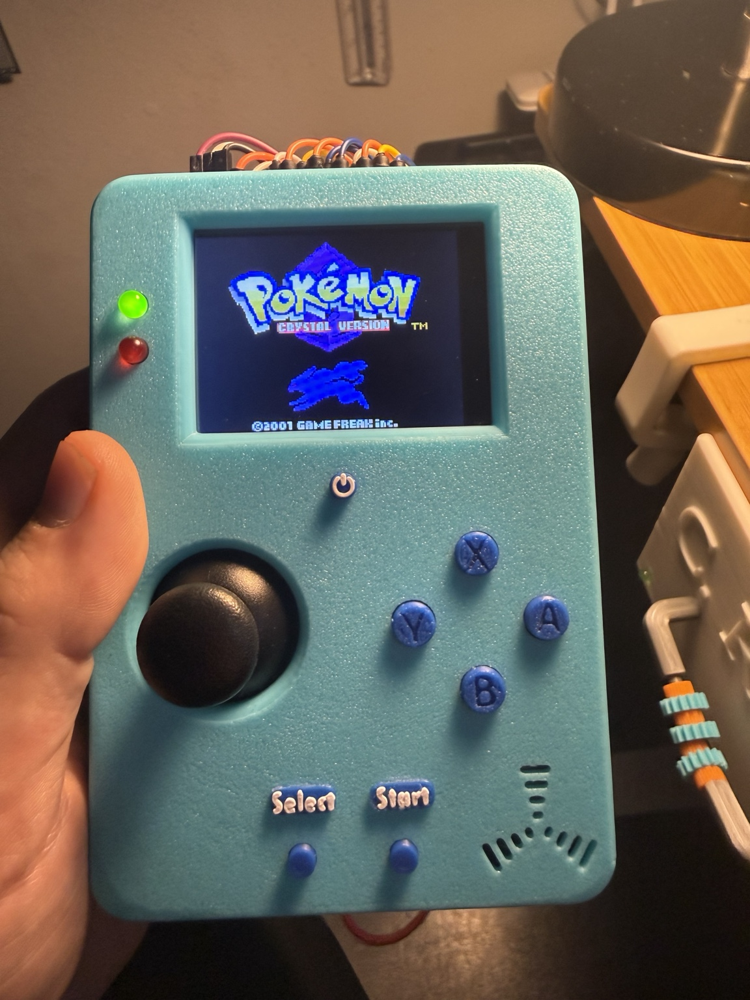
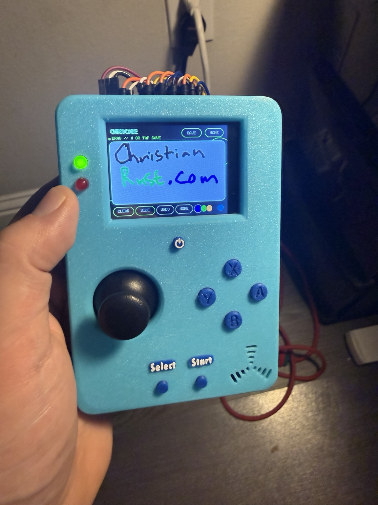
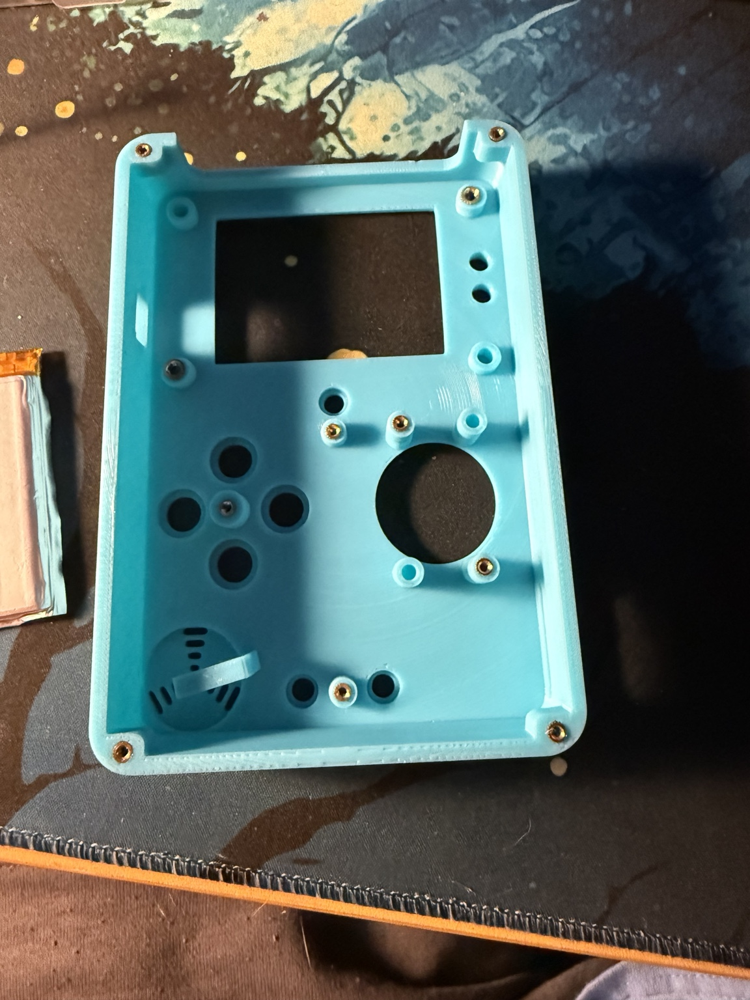
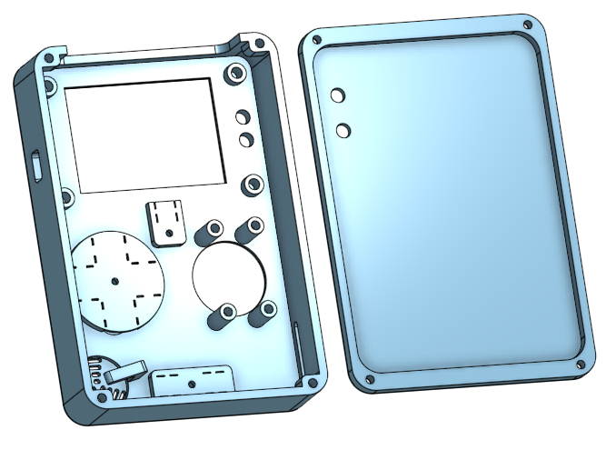

# CHRISCADE

**A custom RP2040 handheld console with a 3D-printed shell, touch-first UI,
Game Boy / Game Boy Color emulation, microSD storage, and a small app library.**

## Quick start

Ready-to-flash firmware is in the clearly marked
[FLASH-ME](FLASH-ME/) folder. Open it and use
[`CHRISCADE_v273_FLASH_THIS.uf2`](FLASH-ME/CHRISCADE_v273_FLASH_THIS.uf2).
The [3MF-FILES](3MF-FILES/) folder contains the printable enclosure parts.
The author-supplied optimized Crystal test build is documented in
[OPTIMIZED-CRYSTAL](OPTIMIZED-CRYSTAL/).

<p align="center">
  
  
  
</p>

<p align="center"><i>From enclosure concept to printed handheld and custom firmware.</i></p>

<p align="center">
  
</p>

## What it does

- Runs legally owned Game Boy and Game Boy Color games from a FAT32 microSD card
- Saves game progress to the SD card
- Includes an author-supplied optimized Pokémon Crystal test-build workflow for this RP2040 handheld
- Provides a themed game launcher with touch and physical controls
- Includes Draw, Calculator, Timer / Stopwatch / Alarm, Metronome, Settings, and Gallery apps
- Captures screenshots into per-game and per-app SD folders; screenshots can be renamed or edited
- Supports a custom animated boot sequence, boot themes/sounds, brightness, LEDs, battery status, audio, and sleep controls
- Uses a USB game-transfer workflow so games can be managed without removing the SD card

## Hardware

- CrowPanel RP2040 touchscreen controller/display
- Parallax joystick
- 6 mm A/B/X/Y buttons and approximately 3.3 mm Start, Select, and Power buttons
- 10 kΩ volume potentiometer, speaker/amplifier, status LEDs, microSD, and jumper wiring
- Custom 3D-printed enclosure and controls

The printable shell and button files, component list, and assembly notes are in
[hardware/README.md](hardware/README.md).
The printable files are also directly accessible in the root
[3MF-FILES](3MF-FILES/) folder.

## CHRISCADE pinout

This is the active CrowPanel RP2040 configuration in `platformio.ini` and
`src/common.h`:

| Function | Pico GPIO / mapping |
| --- | --- |
| A / B buttons | GP0 / GP1 |
| X / Y buttons | GP2 / GP3 |
| Start / Select | GP4 / GP5 |
| Low-power button | GP20 |
| Joystick X / Y | GP26 / GP27 (analog) |
| Speaker audio | GP19 (PWM) |
| Volume potentiometer | GP28 (analog) |
| TFT SCLK / MOSI / MISO | GP10 / GP11 / GP12 |
| TFT CS / DC / RST / backlight | GP9 / GP8 / GP15 / GP18 |
| Touch controller CS | GP16 |
| microSD CS | GP22 |

The TFT, touch controller, and microSD share the SPI1 bus on GP10–GP12 and
use separate chip-select lines. The six directional controls are handled by
the CrowPanel input mapping in firmware; the joystick supplies the analog
direction input. Verify the board revision and wiring before connecting power.

## Build

Install PlatformIO, then build the `pico` environment:

```sh
pio run -e pico
```

The UF2 is created at `.pio/build/pico/firmware.uf2`. Hold BOOTSEL while
connecting the Pico, then copy that file to the mounted `RPI-RP2` drive.

## Limitations

- Game Boy / Game Boy Color compatibility is experimental; some games may
  freeze, fail to launch, or run below full speed.
- The optimized Pokémon Crystal build is a hardware-specific test build, not a
  general replacement for every Crystal ROM or emulator.
- Larger or more demanding GBC games can still stutter, especially during
  overworld streaming, audio-heavy scenes, or menu transitions.
- The RP2040 is overclocked for emulation performance. This can increase heat,
  power use, and long-term hardware stress.
- The current build reserves part of the Pico's flash for the firmware and
  filesystem, so usable ROM capacity is lower than the board's advertised
  flash size.
- SPI display bandwidth and shared peripherals can limit frame rate and may
  produce occasional tearing or input/audio artifacts.
- The enclosure and wiring are custom hardware; fit, button feel, battery
  behavior, and pin compatibility depend on the individual build.
- Only use game files you legally own. ROMs, saves, screenshots, and generated
  firmware binaries are not included in the source repository.

> This repository includes firmware, CAD, and documentation only. It does not
> contain commercial ROMs, save data, screenshots, or generated UF2 releases.
> The optimized Crystal build was provided by Chris Rust for testing, but the
> game file itself is not redistributed here. Use only game dumps you legally own.

## Credits

CHRISCADE is a heavily customized fork built on
[YouMakeTech's Pico-GB](https://github.com/YouMakeTech/Pico-GB), itself based
on deltabeard's Peanut-GB / RP2040-GB work. Thanks to those projects and their
contributors, as well as Bodmer's TFT_eSPI and the other libraries included in
this source tree. Their license notices remain with their respective code.
